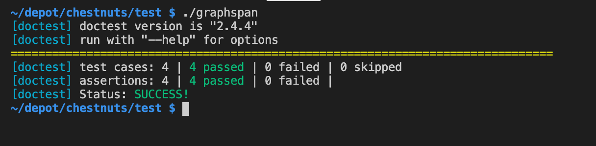

# Chestnuts

Some average to middling solutions to the chestnut questions that
sometimes get posed in tech interviews.

No attempt has been made to be clever.  This is basically as I would do 
if I were actually in an interview.

* [Fibonacci sequence](#fibonacci) - return first N fibonacci numbers
* [Fizz buzz](#fizzbuzz) - the classic "fizz-buzz" problem
* [Logic test](#logic) - cascading logic test correctness
* [Power of](#powerof) - find if one number is a power of another
* [Graph span](#graphspan) - does a path exist thru a graph
* [Primes](#primes) - report if each of N integers is prime or not
* [Bubblesort](#bubblesort) - implementation of the bubblesort algorithm
* [Regex](#regex) - filter rows of data using a regular expression
* [Coin change](#coins) - how many ways can change of N be given by coins C

Each problem is solved in a single C++ file designed to take command line 
input - because that's how these tech interview questions are framed.

## String functions

There's an include directory with some basic string & utility functions.

I did get a bit annoyed with multiple implementations of basic string parsing
(which was done very badly in the framing code included with some online 
coding challenges) so have put my own versions of these into a single include
directory for clarity.

In an interview I would just put it inline above the code.

## Unit tests

Some of the examples are a bit more complex and inspection alone is not a good
guide to correctness. For this reason I've included unit tests for most of the
examples, even though I'd never have time in an interview setting to do this.

The tests use [doctest](https://github.com/onqtam/doctest) which is simply 
included here as a header file.



If the tests are passing the result should look as above. Again, I would not
do these in an interview but I've included them because I wanted to be sure
my code had some degree of correctness.

## Sample Data

For the same reason there's example data for some of them as well.

Generally once the binary is compiled, send the example data into it via 
shell redirection:

`./graphspan < example.txt`

## Pre-Requisites

You just need a [C++ compiler](https://webkit.org/build-tools/), and a
command line.

## Visual Studio Code

Config files for Visual Studio Code are included in case that's installed.
To use these, install the C/C++ extension.

----

# Code and Howto

## fibonacci 

Calculates the [Fibonacci sequence](https://codercareer.blogspot.com/2011/10/no-15-fibonacci-sequences.html).  Known issues: doesn't work with larger numbers.

To change this to answer the question "Return the Nth number of the fibonacci sequence" use the same code and
just return the last entry in the vector.

Do not use recursion as this is inefficient and a [tabulated approach with a vector works nicely](https://youtu.be/oBt53YbR9Kk?t=11479).

To run:

    cd fibonacci
    g++ -std=c++17 -o fibonacci fibonacci.cpp

    ./fibonacci

----

## fizzbuzz

Display the _FizzBuzz_ sequence. Described [on C2 wiki](http://wiki.c2.com/?FizzBuzzTest).

> Write a short program that prints each number from 1 to 50 on a new line. 
> For each multiple of 3, print "Fizz" instead of the number. 
> For each multiple of 5, print "Buzz" instead of the number. 
> For numbers which are multiples of both 3 and 5, print "FizzBuzz" instead of the number.

To run:

    cd fizzbuzz
    g++ -std=c++17 -o fizzbuzz fizzbuzz.cpp

    ./fizzbuzz

*Input*

The fizzbuzz series is hard-coded to 50, as per the question text. No user input is required.

----

## logic

Given the expected and actual return dates for a library book, create a program that calculates the fine (if any). The fee structure is as follows:

* If the book is returned on or before the expected return date, no fine will be charged (i.e.: `fine = 0`).
* If the book is returned after the expected return day but still within the same calendar month and year as the expected return date, `fine = 15 * days_late`.
* If the book is returned after the expected return month but still within the same calendar year as the expected return date, the `fine = 500 * months_late`.
* If the book is returned after the calendar year in which it was expected, there is a fixed fine of `fine = 10000`.

----

## powerof

Find if a number is a power of another number. From a [post by American Dreamer](https://hardcoded.medium.com/coding-interview-question-for-sdet-role-daa0c8eb230f)

> Initally write a program to check if given number is power of three. What about other bases than 3?

    cd powerof
    g++ -O powerof.cpp -o powerof
    ./powerof

*Input*

to ask if 19683 is a power of 3, start the program, type `19683` and press `<enter>`, then type 5, then
press `<enter>`:

    ./powerof
    19683
    3
    true

*Tests*

    cd test
    g++ -std=c++17 -stdlib=libc++ -Wall -O powerof.cpp -o powerof
    ./powerof

----

## graphspan

Determine if a graph contains a specified path.

> Input shall be as follows:

> line 0: n

> Next n lines: A,B - where A and B are city names

> Last line S,D - source and dest to find path

> Print "true" or "false" if a path exists

Note that this is a reduced requirement from a more general shortest path
search which can be solved by Djikstra's algorithm. This does not
require printing the path, or finding a shortest path - so it can exit early.

To run:

    cd graphspan
    g++ -std=c++17 -stdlib=libc++ -Wall -O -o graphspan graphspan.cpp

    ./graphspan < example.txt

To run tests:

    cd test
    g++ -std=c++17 -stdlib=libc++ -Wall -O -o graphspan graphspan.cpp
    ./graphspan

----

## primes

> Input an integer N and then input N integers p to test if they are prime.

>  A prime is a natural number greater than 1 that has no positive divisors 
>  other than 1 and itself. 

>  Given each number, p, find and print whether it is Prime or Not Prime.

>  Note that 1 is not prime, and 2 is prime. Negative numbers cannot 
>  be prime, but negative inputs are out of scope.


To run:

    cd primes
    g++ -std=c++17 -stdlib=libc++ -Wall -O -o primes primes.cpp

    ./primes < test1.txt

To run tests:

    cd test
    g++ -std=c++17 -stdlib=libc++ -Wall -O -o primes primes.cpp
    ./primes

----

## bubblesort

Sort a list of integer numbers using the bubblesort algorithm.

> Input shall be as follows:

> line 0: n

> Next line: n integer numbers seperated by spaces

> Print the list of n integers in sorted order (low to high)

To run:

    cd bubblesort
    g++ -std=c++17 -stdlib=libc++ -Wall -O -o bubblesort bubblesort.cpp
    ./bubblesort < example.txt

To run tests:

    cd test
    g++ -std=c++17 -stdlib=libc++ -Wall -O -o bubblesort bubblesort.cpp
    ./bubblesort

### random

Trivial command line tool to create random numbers, which I put in the bubble 
sort example text files.

    cd random
    gcc random.c -o rand
    echo 18 > example.txt
    (for i in `seq 1 18`; do r=`./rand`; echo -n "$r "; done; echo "") >> example.txt

----

## regex

Consider a database table `Emails`, which has the attributes `First Name` and `Email ID`.
Given rows of data simulating the Emails table, print an alphabetically-ordered list of 
people whose email address ends in **gmail.com**.

### Input Format

The first line contains an integer, N, total number of rows in the table.
Each of the N subsequent lines contains 2 space-separated strings denoting a 
person's first name and email ID, respectively.

The email address is `<user>` + `@` + `<domain>` where each of user and domain
are strings of characters other than `@`.

### Output Format

Print an alphabetically-ordered list of first names for every user with a gmail
account. Each name must be printed on a new line.

### Sample Input

```
6
riya riya@gmail.com
julia julia@julia.me
julia sjulia@gmail.com
julia julia@gmail.com
samantha samantha@gmail.com
tanya tanya@gmail.com
Sample Output

julia
julia
riya
samantha
tanya
```

----

## coins

Given an amount N and the denominations C of coins available, determine how 
many ways change can be made for amount N. There is a limitless supply of
each coin type.

Example

```
N = 3
C = [ 8, 3, 1, 2 ]
```

There are 3 ways to make change for `N = 3`: { 1, 1, 2 }, { 1, 2 }, and { 3 }.
Note that { 1, 1, 2 } and { 1, 2, 1 } are the same way - order is not significant.

To compile and run:

```
cd coins
g++ -std=c++17 -stdlib=libc++ -I ./include -I ../include -Wall -O coins.cpp -o coins

./coins < test.txt
```

To test:

```
cd test
g++ -std=c++17 -stdlib=libc++ -I ./include -I ../include -Wall -O coins.cpp -o coins
```

### Dynamic Programming

This example uses dynamic programming. The results of each previous step in the progressive
calculation uses previously calculated results, which are maintained in a table. Once the
table is completed the answer can be read out from the final cell.

To see the table being built (for small values of N and C) uncomment the relevant section
in the code, or compile like this:


```
cd coins
g++ -std=c++17 -stdlib=libc++ -DPRINT_TABLE=1 -I ./include -I ../include -Wall -O coins.cpp -o coins

./coins < test.txt
```

The result will be eg:

```
         0      1      2      3      4      5      6      7      8      9     10  
    2    1      0      1      0      1      0      1      0      1      0      1  
    5    1      0      1      0      1      1      1      1      1      1      2  
    3    1      0      1      1      1      2      2      2      3      3      4  
    6    1      0      1      1      1      2      3      2      4      4      5  
5
```

## Run all tests

Use the script `runall.sh` which will attempt to compile all problems and then run the tests.

Generally a problem `p` in directory `p` and its test `test/p` can be compiled with:

```
g++ -std=c++17 -stdlib=libc++ -stdlib=libc++ -I ./include -I ../include -Wall -O -o $p $p.cpp
```

...although many of the simpler ones don't require all those options.


## Credits

Some of the inspiration for these examples comes from HackerRank problems, and some from various
YouTube and other online challenges.

The code is all mine (its not great code) and is made available under the MIT license (included).